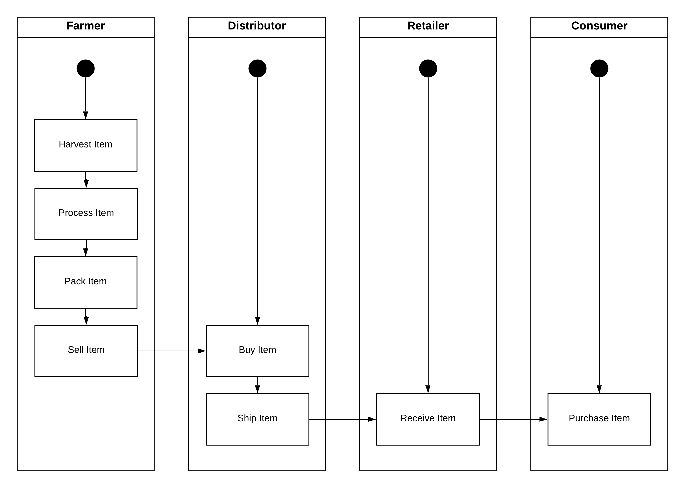
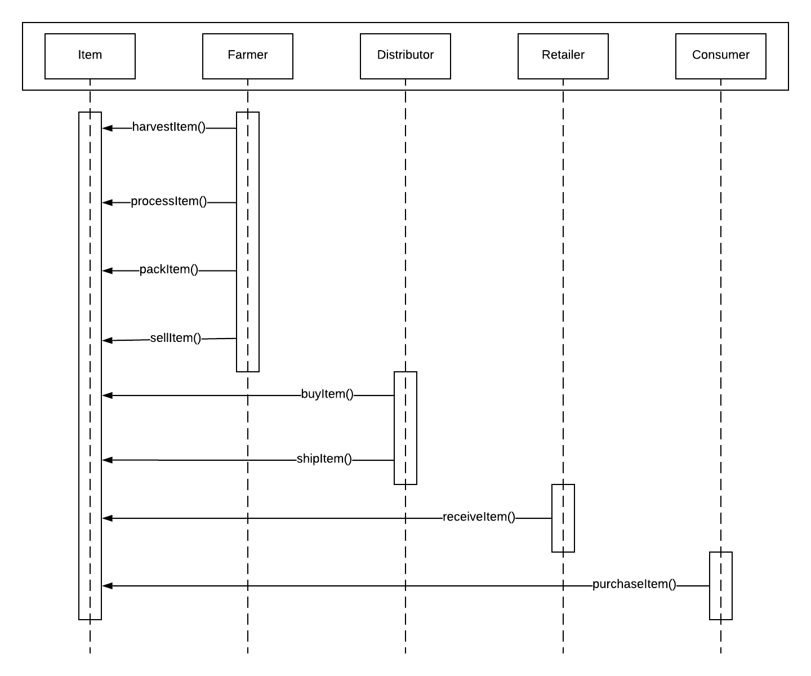
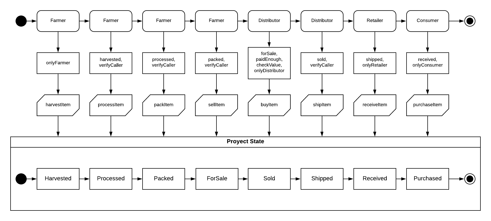
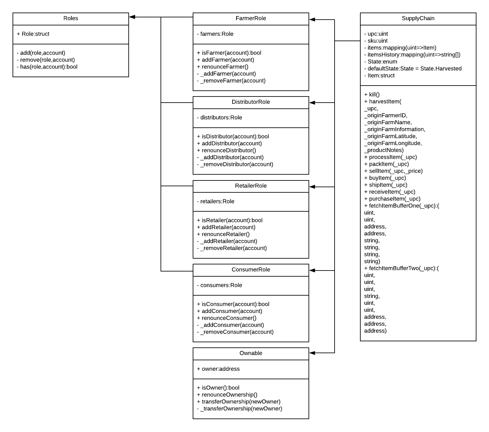

# Ethereum-Dapp-for-Tracking-Items-through-Supply-Chain

This is a DApp supply chain solution backed by the Ethereum platform.
It tracks an items state through its life cycle from the farmer to the consumer.
It considers four different actors that interact in this supply chain: Farmer, Distributor, Retailer and Consumer.
Each actor has his own user permission controls and different actions associated to his role:

- Farmer can harvest, process, pack and sell the item.
- Distributor can buy and ship the item.
- Retailer can receive the item.
- Consumer can purchase the item.

Each time a valid action is performed the items state is changed (Harvested, Processed, Packed, ForSale, Sold, Shipped, Received, Purchased).

The item's complete info and the addresses of the actors that have interacted with it can be tracked and it's authenticity verified at any point through this supply chain. 

# Activity diagram

# Sequence diagram

# State diagram

# Class diagram

# Contract on Rinkeby network
Transaction hash: 0x370d287508dd3fc1552e0c272abe672926f239f2070d609c14f14042cda7770d

Contract address: 0x23126afb1af83a60b2032ef404d81daabfb169df

# Libraries
  - Based on the Udacity project code: https://github.com/udacity/nd1309-Project-6b-Example-Template
  
  - Truffle v4.1.14 (core: 4.1.14)
  
    Truffle is the development environment, testing framework and asset pipeline for blockchains using the Ethereum Virtual Machine (EVM) and a fast and easy way to set up a development enviroment for our DApp.
  
  - Solidity v0.4.24 (solc-js)
  
    Solidity is an object-oriented, high-level language for implementing the required smart contracts.
  
  - Node v10.15.3
    
    Node.js is the JavaScript development environment for the DApp.
  
  - Web3.js 1.0.0-beta.55
  
    Web3.js is the collection of libraries which allow the interaction of our frontend Dapp with a local or remote Ethereum node.
  
  - truffle-hdwallet-provider 1.0.14
  
    HD Wallet-enabled Web3 provider. Use it to sign transactions for addresses derived from a 12-word mnemonic.
  
